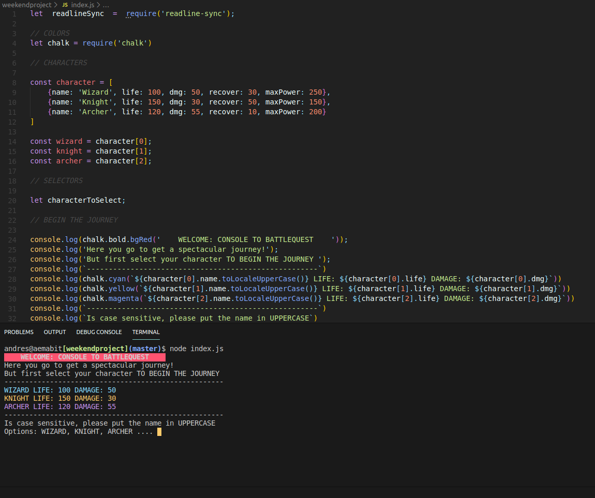
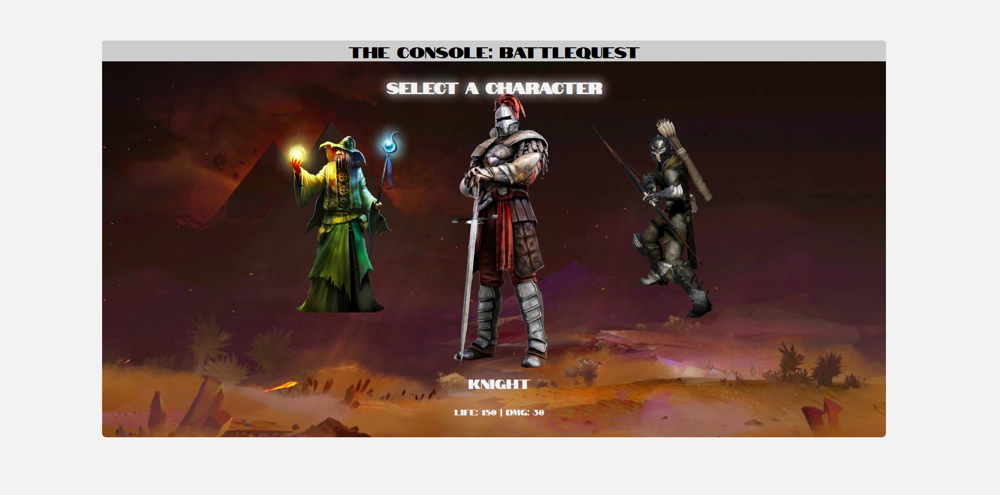

# THE FABULOUSE JS

## Description
This is my second weekend project in Wyncode. The idea is use only JS.

## Objetives
* Make a game from scracth with **readlineSync**.
* Be creative.
* Your game should have at least 3 steps.
* Some questions must depend on previous responses to questions. (“Choose your own Adventure” style.)